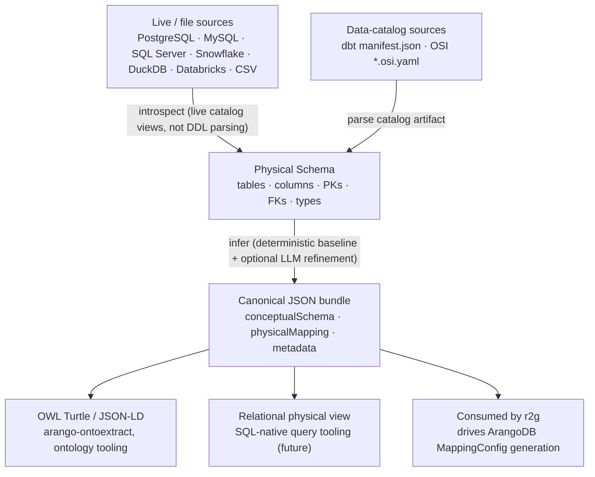

# relational-schema-analyzer

Analyze a **relational database schema** and produce a canonical **conceptual model**
(entities / relationships / properties), a **conceptual → physical mapping** back to the
source relational schema, and **metadata** (confidence, fingerprints, patterns). Optional
exports include **OWL** (Turtle / JSON-LD) for ontology pipelines.

This library is the relational analogue of
[`arangodb-schema-analyzer`](https://pypi.org/project/arangodb-schema-analyzer/) and
emits the **same tool-contract bundle shape** so that downstream consumers
(`arango-ontoextract`, transpilers, and ETL tools such as `r2g`) can treat relational and
ArangoDB sources interchangeably.



## Status

Active development — **v0.4.0 on [PyPI](https://pypi.org/project/relational-schema-analyzer/)**
(`pip install relational-schema-analyzer`). All core phases (0–5) are implemented: the
physical core (connectors, types, FK inference) extracted from `r2g`; a deterministic
conceptual baseline that emits a contract-valid `{conceptualSchema, physicalMapping, metadata}`
bundle with no LLM; OWL (Turtle / JSON-LD) exports and a CLI; optional, additive LLM
refinement; and the v1 tool-contract entrypoint + MCP server. Two data-catalog sources
(`dbt`, `osi`) ship alongside the seven live/file sources. Remaining work is the live Docker
introspection corpus and the downstream `r2g` / `arango-ontoextract` integration PRs. See:

- [`docs/DESIGN.md`](docs/DESIGN.md) — architecture, data model, tool contract, OWL mapping
- [`docs/IMPLEMENTATION-PLAN.md`](docs/IMPLEMENTATION-PLAN.md) — phased delivery plan & extraction inventory

```python
from relational_schema_analyzer import (
    create_connector, RelationalSchemaAnalyzer, export_owl_turtle,
)

physical = create_connector("postgresql", url, schema_name="public").get_schema()
analysis = RelationalSchemaAnalyzer().analyze(physical)   # baseline, no LLM
bundle = analysis.to_bundle()    # {conceptualSchema, physicalMapping, metadata}
ttl = export_owl_turtle(analysis)

# Optional LLM refinement (additive; falls back to baseline on any error):
refined = RelationalSchemaAnalyzer(
    llm_provider="openai",           # or "anthropic" / "openrouter" / a provider object
).analyze(physical)                  # better names + embed/n-ary hints
```

```bash
relational-schema-analyzer snapshot --source postgresql --url "$DSN" -o physical.json
relational-schema-analyzer analyze  --from-snapshot physical.json --pretty
relational-schema-analyzer owl      --from-snapshot physical.json --format turtle -o schema.ttl
```

Sources: `postgresql`, `mysql`, `sqlserver`, `snowflake`, `duckdb`, `databricks`, `csv`,
plus two **data-catalog** sources (see `docs/DESIGN.md` §9.3.1): `dbt` (a dbt
`manifest.json` — tests/contracts → constraints + FKs) and `osi` (an Open Semantic
Interchange `*.osi.yaml` model — datasets/fields/primary_key/unique_keys → tables +
constraints, `relationships` → FKs; OSI carries no column types, so types degrade to
`temporal` for `is_time` fields and `string` otherwise). The `osi` source needs
PyYAML: `pip install 'relational-schema-analyzer[osi]'`.

**Consumer metadata passthrough (0.2.0).** `Column` and `Table` carry an optional
`extra: dict` that the analyzer never reads or interprets — it only guarantees the
data survives serialization round-trips. This lets a consumer (e.g. `r2g`'s Phase-9
governance `classification`) adopt these types without losing its own per-column /
per-table metadata. `extra` is omitted from serialization when empty, so schema
dumps and `physicalSchemaFingerprint` values are byte-identical for schemas that
don't use it.

**MCP server** (optional, `pip install 'relational-schema-analyzer[mcp]'`) exposes the same
`snapshot` / `analyze` / `owl` operations over the v1 tool contract:

```bash
relational-schema-analyzer-mcp                                   # stdio (local IDE)
relational-schema-analyzer-mcp --transport sse --host 0.0.0.0 --port 8000   # remote (set RSA_MCP_TOKEN)
```

## Why this exists

Most of the relational **introspection** layer already exists and is battle-tested inside
the `r2g` (relational-to-graph) project, but it is welded to ArangoDB ETL and cannot be
reused elsewhere. This repo extracts that core into a paradigm-neutral library and adds the
**conceptual / OWL layer** that `r2g` never had, conforming to the contract the ArangoDB
analyzer already publishes.

## License

Apache-2.0 — matching the surrounding Arango ecosystem libraries
(`arangodb-schema-analyzer`, `r2g`). See [`LICENSE`](LICENSE).
